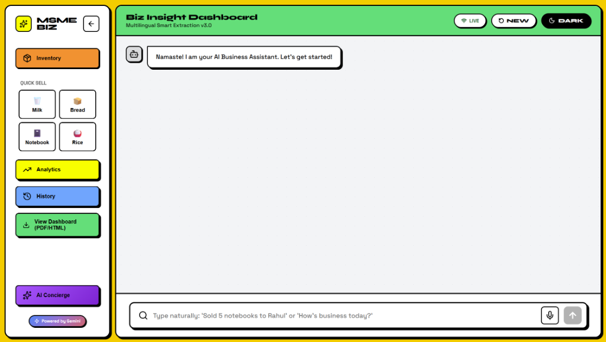
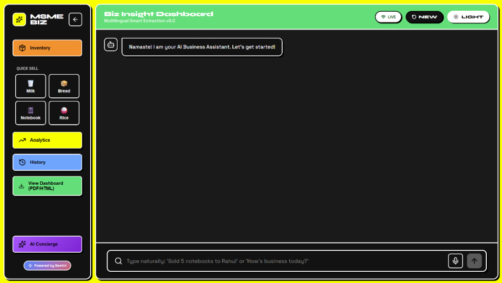
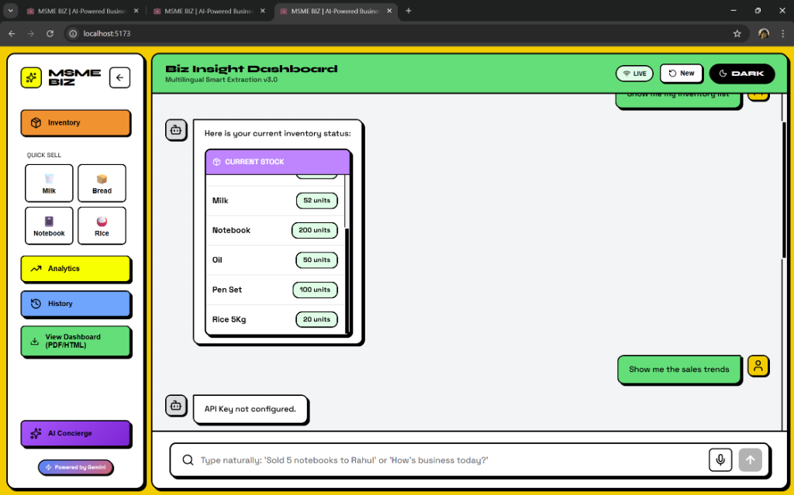
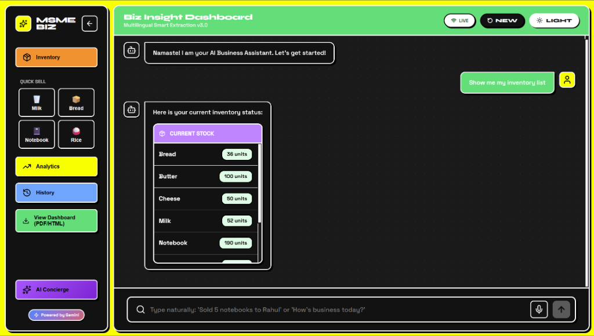
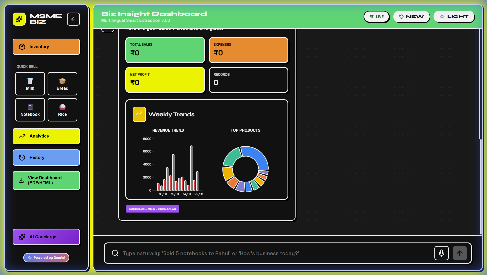
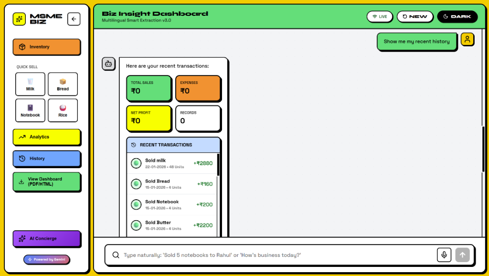
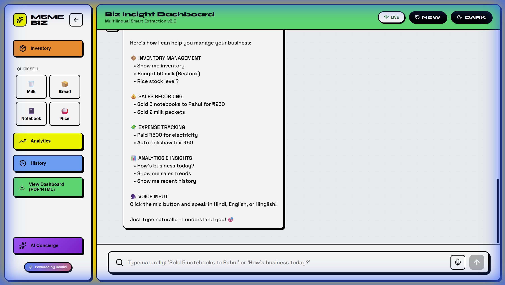
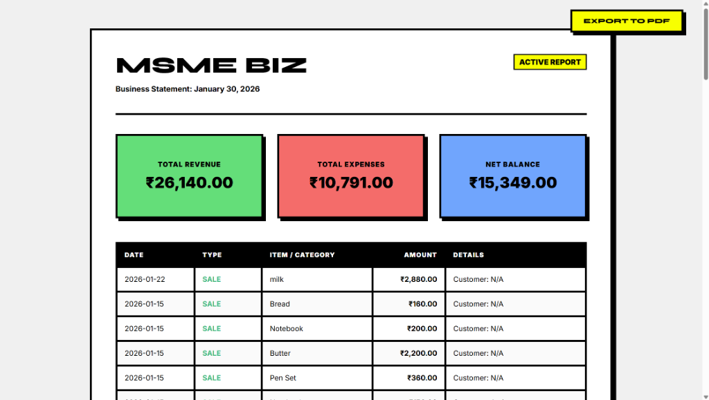

# MSME BIZ 💼
### AI-Powered Business Assistant for Indian Enterprises

> **Multilingual Smart Extraction v3.0** — Talk to your business in any language!


<br/>



---

## 🌟 What is MSME BIZ?

MSME BIZ is an AI-powered business assistant designed specifically for Indian Micro, Small, and Medium Enterprises (MSMEs). It allows business owners to manage their finances and inventory using **natural language** in:

- 🇮🇳 **Hindi** (हिंदी)
- 🇬🇧 **English**
- 🗣️ **Hinglish** (Mix of both!)
- 🎤 **Voice Input** supported

---

## 🌓 Theme Support

MSME BIZ comes with a beautiful **Dark Mode** for night-time usage.

### 📊 Dashboard
| Light Mode | Dark Mode |
|------------|-----------|
|  |  |

### 📦 Inventory
| Light Mode | Dark Mode |
|------------|-----------|
|  |  |

---

## 📸 More Screenshots

| 📊 Analytics (Deep Dive) | 📜 Transaction History |
|--------------------------|------------------------|
|  |  |

| 🤖 AI Concierge | 📜 Transaction History |
|-----------------|------------------------|
|  |  |

| 📄 Report (PDF Export) | |
|------------------------|---|
|  | |

---

## ✨ Key Features

| Feature | Description |
|---------|-------------|
| 📝 **Natural Language Input** | Just type "Sold 5 notebooks to Rahul for ₹250" |
| 💬 **Multilingual Support** | Works in Hindi, English, Hinglish |
| 📊 **Smart Analytics** | Weekly trends, top products, best customers |
| 📦 **Inventory Management** | Track stock, get low-stock alerts |
| 📄 **Export Reports** | HTML dashboard with Print-to-PDF |
| 🎤 **Voice Input** | Speak your transactions |
| 🌙 **Dark Mode** | Easy on the eyes |

---

## 🚀 Quick Start

### Prerequisites

- **Python 3.8+**
- **Node.js 18+**
- **Google Gemini API Key** (Get it free: https://ai.google.dev/)

### 1. Clone the Repository

```bash
git clone https://github.com/your-username/msme-biz.git
cd msme-biz
```

### 2. Backend Setup

```bash
# Create and activate virtual environment (recommended)
python -m venv venv
venv\Scripts\activate  # Windows
# source venv/bin/activate  # Linux/Mac

# Install dependencies
pip install fastapi uvicorn python-dotenv google-generativeai pydantic

# Create .env file with your API key
echo GEMINI_API_KEY=your_api_key_here > .env

# Run the backend server
python app.py
```

The backend will start at `http://localhost:8000`

### 3. Frontend Setup

```bash
# Navigate to frontend directory
cd frontend

# Install dependencies
npm install

# Start development server
npm run dev
```

The frontend will start at `http://localhost:5173`

---

## 💡 How to Use

### Recording a Sale
```
"Sold 5 notebooks to Rahul for ₹250"
"बेचा 10 दूध पैकेट ₹600 में"
"Customer Sharma ko 3 bread diya, ₹120"
```

### Adding an Expense
```
"Paid ₹500 for electricity bill"
"किराया दिया ₹2000"
```

### Checking Inventory
```
"How much milk do I have?"
"Show me my inventory"
"Stock check karo"
```

### Getting Insights
```
"How's business today?"
"Who is my best customer?"
"Top selling products?"
```

---

## 📁 Project Structure

```
GDG_Hackathon/
├── app.py              # FastAPI backend server
├── assistant.py        # Gemini AI integration
├── database.py         # SQLite database operations
├── schemas.py          # Pydantic data models
├── cms.db              # SQLite database file
├── .env                # API keys (not in git)
└── frontend/           # React + Vite frontend
    ├── src/
    │   ├── App.jsx           # Main application
    │   ├── AnalyticsWidget.jsx
    │   ├── index.css         # Neo-brutalist styles
    │   └── main.jsx
    └── package.json
```

---

## 🎨 Design Philosophy

MSME BIZ uses a **Neo-Brutalist** design style:
- Bold, high-contrast colors
- Thick borders and shadows
- Playful yet professional
- Highly accessible

---

## 🔐 Security Note

- Your `.env` file contains sensitive API keys - never commit it!
- The `.gitignore` is configured to exclude it automatically

---

## 📊 API Endpoints

| Endpoint | Method | Description |
|----------|--------|-------------|
| `/process` | POST | Process natural language message |
| `/stats/weekly` | GET | Get weekly sales/expense trends |
| `/stats/top_products` | GET | Get top selling products |
| `/stats/low_stock` | GET | Get low stock alerts |
| `/export/html` | GET | Export HTML dashboard |
| `/export/csv` | GET | Export CSV report |
| `/health` | GET | Health check |

---

## 🤝 Team Zency

Built with ❤️ for the GDG Hackathon 2026

---

## 📜 License

MIT License - Feel free to use and modify!

---

## 🙏 Acknowledgments

- **Google Gemini AI** for powering the natural language processing
- **Google Developer Groups (GDG)** for hosting the hackathon
- All MSMEs across India who inspired this project
